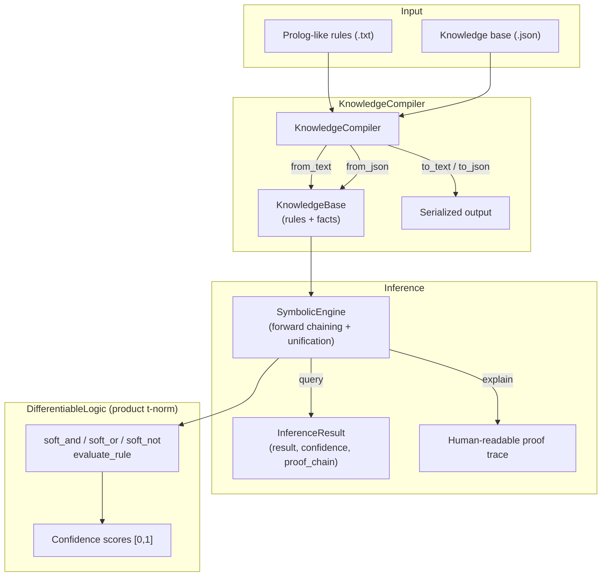

# aumai-neurosymbolic

> Bridge neural and symbolic AI with differentiable logic

[](https://github.com/aumai/aumai-neurosymbolic/actions)
[](https://pypi.org/project/aumai-neurosymbolic/)
[](LICENSE)
[](https://python.org)

> **Experimental.** This library implements ideas from the active research area
> of neuro-symbolic AI. APIs may change between minor versions. Use in production
> requires careful evaluation of the soft-logic approximations described below.

---

## What is this? (Plain English)

Imagine you want an AI agent to reason about access control:

> "If a user has `role=admin` AND the resource is `classified=false`, THEN
> allow access."

You could hard-code that as an `if` statement. But what happens when the rule
is *probably* true 90% of the time, learned from data, and needs to interact
with the output of a neural network classifier that says "classified=false with
confidence 0.87"?

`aumai-neurosymbolic` solves exactly this. You write the rule in a Prolog-like
language, assign a confidence weight to it, and the engine propagates that
weight through the proof chain using **soft (differentiable) logic** — the same
mathematical foundation used in papers like DeepProbLog and Neural Theorem
Provers.

The analogy: think of classical Prolog as a light switch (on/off) and
`aumai-neurosymbolic` as a dimmer (0.0 to 1.0). The dimmer lets you compose
neural perception with symbolic reasoning without forcing a hard threshold
anywhere in the pipeline.

---

## Why does this matter? (First Principles)

Pure neural networks are pattern-matching engines. They generalize beautifully
but are opaque, hard to constrain, and fail silently on out-of-distribution
inputs. Pure symbolic systems (Prolog, CLIPS, Drools) are interpretable and
auditable, but brittle — they break the moment the world deviates from the
hand-curated ontology.

Neuro-symbolic systems aim to get the best of both worlds:

| Property | Neural | Symbolic | Neuro-Symbolic |
|---|---|---|---|
| Interpretability | Low | High | Medium-High |
| Data efficiency | Low | High (rules) | High |
| Handles uncertainty | Yes (implicit) | No | Yes (explicit) |
| Composable with LLMs | Hard | Hard | Natural |

For agentic AI systems — the core use case of the AumAI platform — symbolic
reasoning provides the *governance layer*: the hard invariants and auditable
rules that constrain what a neural agent is permitted to infer or do.

**Research context:**

- Manhaeve et al., "DeepProbLog: Neural Probabilistic Logic Programming"
  (NeurIPS 2018)
- Rocktäschel & Riedel, "End-to-End Differentiable Proving" (NeurIPS 2017)
- Yang et al., "Differentiable Learning of Logical Rules for Knowledge Base
  Reasoning" (NeurIPS 2017)
- Evans & Grefenstette, "Learning Explanatory Rules from Noisy Data"
  (JAIR 2018)

---

## Architecture



---

## Features

- **Prolog-like rule syntax** with inline confidence annotations (`% confidence=0.95`)
- **Forward-chaining inference** with full variable unification (single-pass)
- **Product t-norm soft logic**: `AND(a,b) = a*b`, `OR(a,b) = a+b-a*b`, `NOT(a) = 1-a`
- **Proof chain reconstruction**: every derivation step is recorded and explainable
- **JSON serialization** of knowledge bases for pipeline integration
- **CLI** for scripted queries and compilation (`query`, `compile` commands)
- **Pydantic v2 models** at all boundaries — validated inputs, typed outputs
- **Zero heavy ML dependencies** — pure Python, no PyTorch or TensorFlow required

---

## Quick Start

### Installation

```bash
pip install aumai-neurosymbolic
```

Or from source:

```bash
git clone https://github.com/AumAI/aumai-neurosymbolic
cd aumai-neurosymbolic
pip install -e ".[dev]"
```

### 5-minute example

```python
from aumai_neurosymbolic.core import KnowledgeCompiler, SymbolicEngine

# Define rules in Prolog-like syntax
rules_text = """
% Facts
parent(tom, bob).
parent(bob, ann).
parent(bob, pat).

% Rules with confidence weights
ancestor(X, Y) :- parent(X, Y). % confidence=1.0
ancestor(X, Z) :- parent(X, Y), ancestor(Y, Z). % confidence=0.95
"""

compiler = KnowledgeCompiler()
kb = compiler.from_text(rules_text)

engine = SymbolicEngine(kb)

result = engine.query("ancestor(tom, ann)")
print(result.result)       # True
print(result.confidence)   # 0.95
print(result.proof_chain)  # ['parent(tom, bob)', 'parent(bob, ann)', ...]

# Human-readable explanation
print(engine.explain("ancestor(tom, ann)"))
```

---

## CLI Reference

### `compile` — convert text rules to JSON

```bash
aumai-neurosymbolic compile \
  --input rules.txt \
  --output rules.json
# Compiled 3 rule(s) and 4 fact(s) to rules.json
```

| Option | Required | Default | Description |
|---|---|---|---|
| `--input PATH` | Yes | — | Path to Prolog-like rules `.txt` file |
| `--output PATH` | No | `<input>.json` | Destination JSON path |

### `query` — prove a goal

```bash
aumai-neurosymbolic query \
  --kb rules.json \
  --goal "ancestor(tom, ann)"
# PROVEN: ancestor(tom, ann)  (confidence=0.9500)
# Proof chain:
#   parent(tom, bob)
#   parent(bob, ann)
#   [r1] parent(bob, ann) => ancestor(bob, ann)
#   [r2] parent(tom, bob) ^ ancestor(bob, ann) => ancestor(tom, ann)
```

Add `--explain` for a full human-readable proof trace:

```bash
aumai-neurosymbolic query \
  --kb rules.json \
  --goal "ancestor(tom, ann)" \
  --explain
```

| Option | Required | Default | Description |
|---|---|---|---|
| `--kb PATH` | Yes | — | Path to JSON knowledge base |
| `--goal TEXT` | Yes | — | Ground literal to prove |
| `--explain` | No | `false` | Print human-readable proof trace |

---

## Python API Examples

### Building a knowledge base programmatically

```python
from aumai_neurosymbolic.models import KnowledgeBase, LogicRule
from aumai_neurosymbolic.core import SymbolicEngine

kb = KnowledgeBase(
    facts=[
        "employee(alice)",
        "department(alice, engineering)",
        "clearance(alice, level2)",
    ],
    rules=[
        LogicRule(
            rule_id="r1",
            head="can_access(X, resource_A)",
            body=["employee(X)", "clearance(X, level2)"],
            confidence=0.99,
        ),
        LogicRule(
            rule_id="r2",
            head="can_access(X, resource_B)",
            body=["can_access(X, resource_A)", "department(X, engineering)"],
            confidence=0.95,
        ),
    ],
)

engine = SymbolicEngine(kb)
result = engine.query("can_access(alice, resource_B)")
print(result.result)      # True
print(result.confidence)  # ~0.9405  (0.99 * 0.95)
```

### Adding facts and rules at runtime

```python
engine.add_fact("clearance(bob, level2)")
engine.add_rule(LogicRule(
    rule_id="r3",
    head="senior_engineer(X)",
    body=["employee(X)", "department(X, engineering)"],
    confidence=0.8,
))
```

### Using DifferentiableLogic directly

```python
from aumai_neurosymbolic.core import DifferentiableLogic
from aumai_neurosymbolic.models import LogicRule

dl = DifferentiableLogic()

# Product t-norm conjunction: a * b
print(dl.soft_and(0.9, 0.8))   # 0.72

# Probabilistic disjunction: a + b - a*b
print(dl.soft_or(0.9, 0.8))    # 0.98

# Standard negation: 1 - a
print(dl.soft_not(0.9))        # ~0.1

# Evaluate a full rule
rule = LogicRule(rule_id="r1", head="goal(X)", body=["a(X)", "b(X)"], confidence=0.9)
confidence = dl.evaluate_rule(rule, {"a(alice)": 0.8, "b(alice)": 0.7})
print(confidence)  # 0.9 * 0.8 * 0.7 = 0.504
```

### Serialization round-trip

```python
from pathlib import Path
from aumai_neurosymbolic.core import KnowledgeCompiler

compiler = KnowledgeCompiler()

# Parse text -> KnowledgeBase
kb = compiler.from_text("""
mortal(X) :- human(X). % confidence=1.0
human(socrates).
""")

# Serialize to JSON
compiler.to_json(kb, Path("kb.json"))

# Reload from JSON
kb2 = compiler.from_json(Path("kb.json"))

# Serialize back to text
print(compiler.to_text(kb2))
```

---

## Rule File Format

Rules follow a subset of standard Prolog syntax:

```prolog
% This is a comment.

% Ground facts (no variables, no body):
human(socrates).
parent(tom, bob).

% Rules (head :- body1, body2):
mortal(X) :- human(X).
ancestor(X, Z) :- parent(X, Y), ancestor(Y, Z).

% Rules with confidence annotations:
likely_manager(X) :- senior(X), department(X, engineering). % confidence=0.85
```

**Variable naming:** identifiers starting with an uppercase letter are treated
as variables (`X`, `Y`, `Z`, `Person`, `Role`). Lowercase identifiers are
constants (`alice`, `bob`, `admin`).

**Confidence annotation:** append `% confidence=<float>` at the end of a rule
line. Values must be in `[0.0, 1.0]`. Rules without this annotation default to
`confidence=1.0`.

---

## How It Works (Deep Dive)

### Forward Chaining

`SymbolicEngine` uses **iterative forward chaining** (bottom-up evaluation):

1. Start with the set of asserted ground facts.
2. For every rule, try to find a variable substitution (grounding) by
   unifying its body literals against the current fact set.
3. If all body literals match, derive the head literal and add it to the
   working fact set.
4. Repeat until fixpoint (no new facts derived) or 1,000 iterations elapsed.

This procedure is sound and complete for Datalog (function-free Horn clauses).
It does not support negation-as-failure, cut, or assert/retract — by design,
to keep reasoning declarative and auditable.

### Confidence Propagation (Product T-Norm)

Each rule carries a `confidence` weight in `[0, 1]`. When a rule fires:

```
head_confidence = rule.confidence * body[0].confidence * body[1].confidence * ...
```

This is the **product t-norm conjunction** — the same operation used in
probabilistic logic programming (PLP) systems like ProbLog. It is differentiable
with respect to all inputs, making it compatible with gradient-based training
loops.

### Unification

Variable substitution follows standard first-order unification restricted to
linear patterns. Variables are identified by uppercase-initial identifiers. The
`_unify` method matches a pattern literal against a ground fact, building or
extending a binding dictionary, returning `None` on failure.

### Proof Chain Reconstruction

The engine maintains a `proof_source` dictionary mapping each derived fact to
the rule and antecedents that produced it. After the fixpoint, a recursive
`_build_proof_chain` traversal produces a linear derivation list (depth-first).

---

## Integration with Other AumAI Projects

| Project | Integration point |
|---|---|
| `aumai-policyminer` | Convert mined `MinedPolicy` objects to `LogicRule` for symbolic verification |
| `aumai-reasonflow` | Export a `ReasoningChain` to logic rules for symbolic validation |
| `aumai-specs` | Use `KnowledgeBase` as a formal specification layer for agent contracts |
| `aumai-guardrails` | Implement hard safety constraints as high-confidence rules |

---

## Limitations and Experimental Caveats

- **Single-pass variable grounding:** rules where variables appear only in the
  head (existential conclusions) are not supported.
- **No function symbols:** arguments must be atomic constants or variables.
  Nested terms like `f(g(X))` are not parsed.
- **No negation-as-failure:** `\+` and `not` are not implemented.
- **Confidence semantics are approximate:** the product t-norm is one of many
  possible choices; it does not correspond to any single probability calculus
  unless body literals are independent.
- **Not a complete PLP system:** for full ProbLog semantics (weighted model
  counting), use ProbLog directly.

---

## Documentation

- [Getting Started](docs/getting-started.md)
- [API Reference](docs/api-reference.md)
- [Examples](examples/)
- [Contributing](CONTRIBUTING.md)

---

## AumOS Governance Integration

`aumai-neurosymbolic` operates as a standalone tool. For enterprise-grade
governance, reasoning engines can be registered as policy validators in AumOS,
where each `KnowledgeBase` forms a verifiable constraint layer over agent
behavior.

---

## Contributing

We welcome contributions! See [CONTRIBUTING.md](CONTRIBUTING.md). In brief:

1. Fork and create a feature branch: `feature/my-improvement`
2. Write tests alongside your code (`pytest` + `hypothesis`)
3. Run `make lint test` before opening a PR
4. Conventional commits: `feat:`, `fix:`, `refactor:`, `test:`, `docs:`

---

## License

Apache 2.0 — see [LICENSE](LICENSE) for details.

## Part of AumAI

This project is part of [AumAI](https://github.com/aumai) — open source
infrastructure for the agentic AI era.
